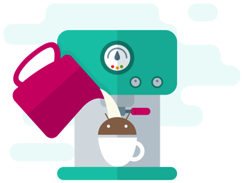

[](https://travis-ci.org/SchibstedSpain/Barista)
[](https://bintray.com/schibstedspain/maven/barista/_latestVersion)

# Barista
**The guy who serves a great Espresso**



Barista makes developing UI test faster, easier and more predictable. Built on top of Espresso, it provides a simple an discoverable API, removing most of the boilerplate and verbosity of common Espresso tasks. You and your Android team will write tests with no effort.


# Download

_Psst, hey. Migrating to Barista 2? [Check out this guide](MIGRATION-2.md) to help you with the transition._

Import Barista as a testing dependency:
```gradle
androidTestCompile('com.schibsted.spain:barista:2.1.0') {
  exclude group: 'com.android.support'
  exclude group: 'org.jetbrains.kotlin' // Only if you already use Kotlin in your project
}
```

You might need to include the Google Maven repository, required by Espresso 3:
```gradle
repositories {
    maven { url "https://maven.google.com" }
}
```


Barista already includes `espresso-core` and `espresso-contrib`. If you need [any other Espresso package](https://developer.android.com/topic/libraries/testing-support-library/packages.html#atsl-dependencies) you can add them yourself.

# API Overview

## Barista’s Interactions API
```java
// Click widgets
clickOn(R.id.button);
clickOn(R.string.button_text);
clickOn("Next");
clickBack();

// Long click widgets
longClickOn(R.id.button);
longClickOn(R.string.button_text);
longClickOn("Next");

// Click menu items, with or without overflow
clickMenu(R.id.menu_item);

// Writing into widgets
writeTo(R.id.edittext, "A great text");
writeToAutoComplete(R.id.autocomplete, "Another great text");

// Operate on ListViews and RecyclerViews indistinctly by position
clickListItem(R.id.list, 4);
clickListItemChild(R.id.list, 3, R.id.row_button);
scrollListToPosition(R.id.list, 4);

clickSpinnerItem(R.id.spinner, 1);

// Select items on RadioButtons
clickRadioButtonItem(R.id.radiogroup, R.id.radio_item);
clickRadioButtonItem(R.id.radiogroup, "The radio text");
clickRadioButtonPosition(R.id.radiogroup, 42);

// Pick data on pickers
setDateOnPicker(1986, 03, 23);

// Interact with dialogs
clickDialogPositiveButton();
clickDialogNeutralButton();
clickDialogNegativeButton();

// Scroll on scrolls and pagers
scrollTo(R.id.far_away_widget);
scrollTo(R.string.text);
scrollTo("A widget with this text");
swipeViewPagerForward();
swipeViewPagerBack();

// Interact with the navigation drawer
openDrawer();
openDrawerWithGravity(Gravity.RIGHT);
closeDrawer();
closeDrawerWithGravity(Gravity.RIGHT);

// Pull to refresh in SwipeRefreshLayout
refresh(R.id.swipe_refresh);
refresh(); // Id is optional! We'll find it for you :D

// And another tricky feature, but try not to use it
sleep(2000);
sleep(2, SECONDS);
```

## Barista’s Assertions API
```java
// Is this view displayed?
assertDisplayed("Hello world");
assertDisplayed(R.string.hello_world);
assertDisplayed(R.id.button);
assertDisplayed(R.id.button, "Hello world")

// ...or not?
assertNotDisplayed("Hello world");
assertNotDisplayed(R.string.hello_world);
assertNotDisplayed(R.id.button);
assertNotDisplayed(R.id.button, "Hello world")

// Is this view enabled?
assertEnabled("Hello world");
assertEnabled(R.string.hello_world);
assertEnabled(R.id.button);

// ...or not?
assertDisabled("Hello world");
assertDisabled(R.string.hello_world);
assertDisabled(R.id.button);

// Hope this view doesn't exist!
assertNotExist("Hello world");
assertNotExist(R.string.hello_world);
assertNotExist(R.id.button);

// Is the expected checkbox checked?
assertChecked("Checked checkbox");
assertChecked(R.string.checked_checkbox);
assertChecked(R.id.checked_checkbox);

// ...and the other checkbox unchecked?
assertUnchecked("Unchecked checkbox");
assertUnchecked(R.string.unchecked_checkbox);
assertUnchecked(R.id.unchecked_checkbox);

// Does this view have the focus?
assertFocused(R.id.focused_view)
assertFocused("Button")

// ... or not?
assertNotFocused(R.id.focused_view)
assertNotFocused("Button")

// Is this ImageView showing a drawable?
assertHasAnyDrawable(R.id.image_view);
assertHasDrawable(R.id.image_view, R.drawable.ic_barista);

// ...or not?
assertHasNoDrawable(R.id.image_view);

// Does this View have a background?
assertHasAnyBackground(R.id.view);
assertHasBackground(R.id.view, R.drawable.ic_barista);

// ...or not?
assertHasNoBackground(R.id.view);

// What's the state of the Drawer?
assertDrawerIsOpen();
assertDrawerIsOpenWithGravity(Gravity.RIGHT);
assertDrawerIsClosed();
assertDrawerIsClosedWithGravity(Gravity.RIGHT);

// Check EditText's hints
assertHint(R.id.edittext, R.string.hint);
assertHint(R.id.edittext, "Hint");

// Check if text on screen contains given text
assertContains("text");
assertContains(R.id.textview, "text");

// ...or not?
assertNotContains("text");
assertNotContains(R.id.textview, "text");

// Check text is given color
assertTextColorIs(R.id.textViewRed, R.color.textRed); // color
assertTextColorIs(R.id.textViewStateRed, R.color.text_state_red); // color state list

// ...or not?
assertTextColorIsNot(R.id.textViewRed, R.color.textBlue); // color
assertTextColorIsNot(R.id.textViewStateRed, R.color.text_state_blue); // color state list

// Check recyclerView item count against expected item count
assertRecyclerViewItemCount(R.id.recycler, 10);

// And another tricky feature
assertThatBackButtonClosesTheApp();
```

## Runtime Permissions

The new Marshmallow permissions system requires checking for permissions at runtime. As Espresso can't interact with the system dialog, Barista offers a way to allow permissions when needed.

```java
PermissionGranter.allowPermissionsIfNeeded(Manifest.permission.GET_ACCOUNTS);
```

## Useful test rules
Barista includes a set of useful test rules to help you:

### Reseting app data

As tests should be isolated, they need to set the environment before running. Espresso doesn't help achieving it but Barista offers a set of rules to clear the app's data before running each test.

```java
// Clear all app's SharedPreferences
@Rule public ClearPreferencesRule clearPreferencesRule = new ClearPreferencesRule();

// Delete all tables from all the app's SQLite Databases
@Rule public ClearDatabaseRule clearDatabaseRule = new ClearDatabaseRule();

// Delete all files in getFilesDir() and getCacheDir()
@Rule public ClearFilesRule clearFilesRule = new ClearFilesRule();
```


### Dealing with Flaky tests

We should try to write deterministic tests, but when everything else fails Barista helps you deal with flaky tests using a specific ActivityTestRule and a couple of annotations that repeat your tests multiple times.

```java
// Use a RuleChain to wrap your ActivityTestRule with a FlakyTestRule
private ActivityTestRule<FlakyActivity> activityRule = new ActivityTestRule<>(FlakyActivity.class);
private FlakyTestRule flakyRule = new FlakyTestRule();

@Rule
public RuleChain chain = RuleChain.outerRule(flakyRule)
    .around(activityRule);


// Use @AllowFlaky to let flaky tests pass if they pass any time.
@Test
@AllowFlaky(attempts = 5)
public void some_flaky_test() throws Exception {
  // ...
}

// Use @Repeat to avoid flaky tests from passing if any repetition fails.
@Test
@Repeat(times = 5)
public void some_important_test() throws Exception {
  // ...
}
```

### One rule to rule them all

All previous rules can be added at the same time by just adding the BaristaRule.
```java
@Rule
public BaristaRule<MyActivity> baristaRule = BaristaRule.create(MyActivity.class);

//...

baristaRule.launchActivity();
```

The rule assumes some sane defaults:
- Retry flaky tests: 10 attempts
- Launch activity automatically: false
- Initial touch mode enabled: true
- Clear preferences
- Clear databases
- Clear files


# Magic that Barista does for you

In order to speed up testing, Barista keeps in mind some considerations.
- **Scrolls when needed**: Interacting with Espresso in a `ScrollView` requires you to scroll to each view, which sometimes doesn't work the first time. Also trying to scroll outside a `ScrollView` produces an `Exception`, forcing you to change the test depending on the layout. To keep tests simpler, Barista scrolls automatically before interacting with any `View`, and only does it if needed.
- **Scrolls on all views**: Barista scrolls on all scrollable views, including `NestedScrollView`. Espresso only handles `ScrollView` and `HorizontalScrollView`, so people need to open questions on [StackOverflow like this](https://stackoverflow.com/questions/35272953/espresso-scrolling-not-working-when-nestedscrollview-or-recyclerview-is-in-coor). Or... just use **Barista**.
- **Just interacts with displayed Views**: Interacting with `View`s inside a `ViewPager` throws `AmbiguousViewMatcherException`, because the views you interact with will be potentially repeated on different pages. Barista only interacts with displayed widgets, so you can focus on the behavior instead of wasting time on details.

# License

```
Copyright 2017 Schibsted Classified Media Spain S.L.


Licensed under the Apache License, Version 2.0 (the "License");
you may not use this file except in compliance with the License.
You may obtain a copy of the License at

   http://www.apache.org/licenses/LICENSE-2.0

Unless required by applicable law or agreed to in writing, software
distributed under the License is distributed on an "AS IS" BASIS,
WITHOUT WARRANTIES OR CONDITIONS OF ANY KIND, either express or implied.
See the License for the specific language governing permissions and
limitations under the License.
```
